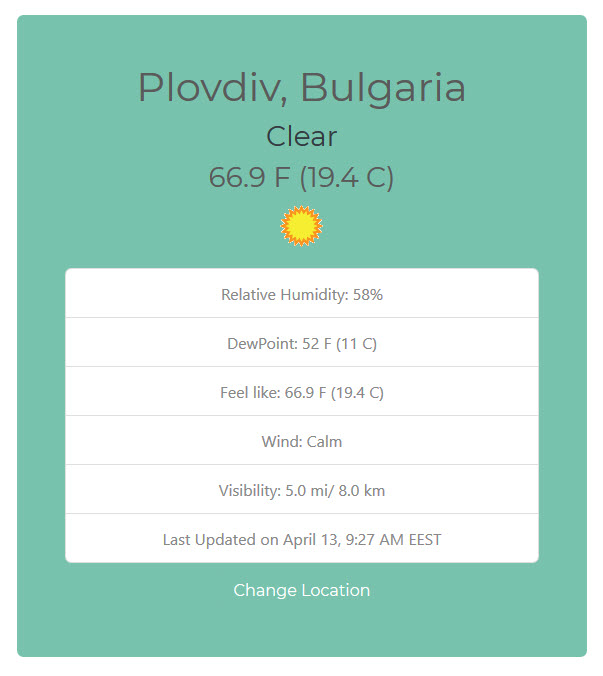
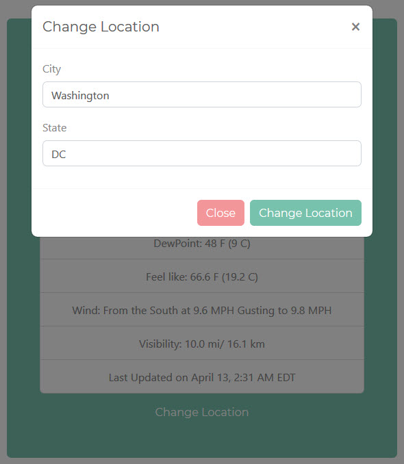

A JS application that displays weather data from a weather API. It uses vanilla JS, jQuery and Bootstrap. The user is given the option to change city and state in order to visualize weather data for different locations.

